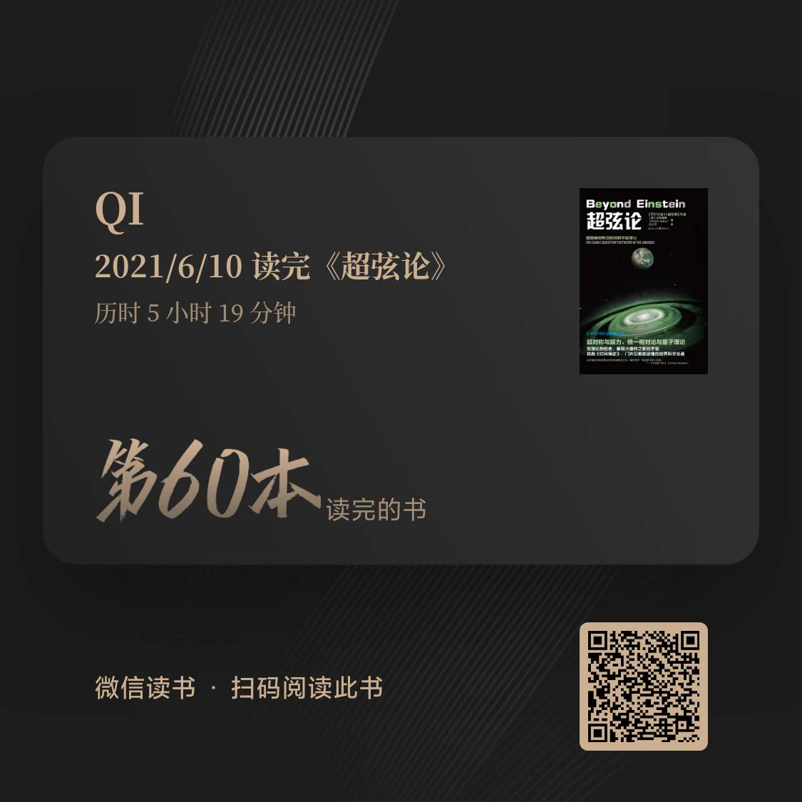

.. _n60:

《超弦论》
=====================

* 作者：加来道雄（かく みちお）

1947年（丁亥年）1月24日出生于美国加利福尼亚州圣何塞。科学畅销书作者，美国著名高等学府加州大学伯克利分校（UC Berkeley）物理学博士[1]、纽约城市大学研究生中心的理论物理学教授[2]，超弦理论的专家[3]。

加来道雄的著作都广受赞誉，《构想未来》《超越爱因斯坦和超空间》《平行宇宙》，均被《纽约时报》和《华盛顿邮报》提名为当年的最佳科学读物之一。他主持着一档全美国联网的科学广播节目，还在《晓闻热线》《60分钟》《早安美国》以及《拉里·金直播在线》之类的全美国性电视节目中亮相[3]。

内容简介
------------

《超弦论》分析了超弦理论的诞生、定义以及它的重要意义。学术界认为，这项革命性的突破有较大可能将爱因斯坦的毕生梦想“万物理论”变为现实——四种基本力被完全统一。
作者生动而形象地为我们列举了当今物理学的诸多难题——统一场论与量子力学的矛盾？牛顿的引力理论如何与相对论和量子理论统一？S矩阵理论和量子场论的对立？GUT理论附带的增殖夸克问题如何解决？什么是超对称？黑洞的权威解？维度旅行可行吗？大爆炸之前是什么？高维为何会卷曲？同时，作者用超弦理论对这些问题作了详细解答，在理论层面回答了困扰我们已久的物理学困惑，畅想了未来科学在数学上证明该理论的可能。本书由14章组成，
第1章，超弦：万物理论；第2章，寻求统一；第3章，量子谜题；第4章，无穷大之谜；第5章，寻找顶夸克；第6章，超弦理论的诞生；第7章，对称性：缺失的一个环节；第8章，超对称；第9章，大爆炸之前；第10章，暗物质的神秘；第11章，宇宙弦；第12章，通往另一个维度的旅程；第13章，回到未来；第14章，超越爱因斯坦。
