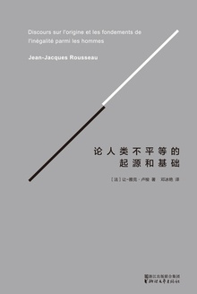

********************************
《论人类不平等的起源和基础》
********************************

作者：让-雅克·卢梭

让-雅克·卢梭（Jean-Jacques Rousseau，1712-1778） 18世纪法国大革命的思想先驱、民主主义者，思想精华和基本原则是“人民主权”。坚持自然神论，唯心主义是他的哲学思想的主要倾向，被称为“自由的奠基人”。他生前遭人唾弃被迫流亡，晚年患“逼害性心理分裂症”，1778年卢梭去世，死时穷困潦倒，死后其思想和著作却大受法国社会的膜拜敬仰。

    卢梭的身影无处不在……他虽然没有产生一个自己的“主义”，但他确实提供了真正的现代性的观点。他对更高的、非物质的道德的关注，是康德唯心主义的基础。他对现代经济学的批判和对私有财产的合法性的质疑，是社会主义特别是马克思主义的根源。他对人的本源而非目的的强调，使人类学成为一门核心学科。而从自然状态走向市民社会的历史运动，对人的本质来说，似乎比人的本性更重要，这是历史主义的观点。他提出社会化过程给人类本性造成的创伤，这成为以弗洛伊德所代表的心理学的新流派。他对美丽的浪漫爱情、对现代社会与崇高和纯洁的精神相容性的怀疑，使为艺术而艺术的崇拜和波西米亚生活有了理由……这些内容和更多意蕴从卢梭的文字流淌出来。他不仅拥有一种无与伦比的知识分子的清晰头脑，同时又拥有一种激动人心的雄辩修辞。

内容简介
============

《论人类不平等的起源和基础》为卢梭1753年应法国第戎科学院的征文而撰写的论文，出版于1755年。在书中，卢梭阐发了自身的政治哲学，为《社会契约论》的写作奠定了基础。

不同于同时代哲学家的乐观认识，卢梭将人类历史的发展过程视作进步与退化的矛盾统一体。他一方面借助当时有关野蛮人的人类学材料，一方面展开辩证的想象，回顾了人类由自然状态向社会状态过渡的历史进程，指出人类的进步史同时也是人类的堕落史，因为人类每向前发展一步，不平等的程度即加深一步。而私有制的确立，是造成人类不平等及其后果的关键环节。

不平等现象出现的三个原因

  * 人自我完善化的能力是不平等的起源
  * 人的需要是社会不平等的诱因
  * 私有制是人类不平等的根源

人自我完善化的能力是不平等的起源
--------------------------------

“实际上是有些人完善了或变坏了，他们获得了一些不属于原来的天性，好的或坏的性质；而另一些人则比较长期的停留在他们的原始状态。这就是人与人之间不平等的起源。”

在人类社会还未形成的时候，在“人”还是自然界中微不足道的一种动物的时候。人与人之间是没有交往的，在各自的世界中互不影响。因为“智力”还没有形成，人类对自然界的欲望，绝不会超过生理需求。人与人之间的差别是极其微小的，诸如体力差别、精力差别等，远不足以在短短的20年的寿命中造成“不平等”的人际关系。人在吃动物的时候，也在被野兽吃，人还在自然界的食物链中。卢梭称之为“自然状态”，在这种情况下，不存在私有观念，不存在私有制，人与人是天然平等的。

一般生物学认为是火的使用，使得原始人的食物得以改善，茹毛饮血顶多是可以吃饱，而熟肉中却含有利于大脑发育的物质。随着大脑的发育，人的智力水平开始提升。开始注意到“我”与“外在世界”是有区别的，开始注意到“我”与“别人”是不同的。即使当时的人既不能完全的认识“我”，又不能客观地看待外在的“世界”，但是对二者之间的区别是有感知的，这是人类智慧的开始。

当有了“我”这个意识之后，人不再是单个的个体动物，而是在人际关系上具有了原始的逻辑性。母亲知道那个是“我”的孩子，孩子知道那个是“我”的亲人。在这种基础认知下，原始的合作劳动就如火如荼地开始了，同时也出现了分工和交换。为了最大限度地防止野兽的侵害以及最高效率的合作劳动，人们自然地选择了跟“我”有血亲关系的人群居在一起。当人们认识到“我”的时候，这是标志着人开始思考人之所以为人这个哲学命题；当人们认识到“我的”的时候，这标志着人开始有了私有观念。

人的需要是社会不平等的诱因
--------------------------------
即使在自然状态下的人也有“食物、异性和休息”的需要，但是人在自然状态下的需要是本能的、低下的。这时的人类只想着满足自己的基本需要。

但是，“人类在达到自然状态的终点以前，需要已经有了很大的进步，获得更多的知识和技巧，并把这些知识和技巧一代一代的传授下去，使它们不断增加起来。”
也就是说，经过一段时间的发展，人类为了更好的满足自身的需要开始学会制作和使用工具。比如说，在沿海或沿河的地方，人们发明了“钓线和钓钩”以捕鱼为生；
在森林附近的人们发明了攻坚以捕猎为生；在寒冷地方的人们以兽皮为衣来抵御寒冷；由于雷电和火山的爆发，人们认识了火能保存火种用来烧烤食物和御寒……
人的这些认识和发明不断的积累和重复，使人的观念发生了变化和飞跃，产生了一种“人比动物优越”的自尊感，从而开始了对动物的占有和奴役，与此同时，人对自己同类的占有和奴役也开始萌生了。

私有制是人类不平等的根源
--------------------------------

这一切的过程标志着，人从自然状态走向了社会状态。原始社会中，人类虽然存在私有观念，但是在相当漫长的时期内是没有私有财产的，大家一起劳动，一起分享劳动成果，由于生产力水平的极端低下，基本上都是吃了上顿没下顿，不会存在所谓的“剩余产品”。当时的人在自然界中处于绝对的劣势地位，把所有的力量集结起来尚且不能应付自然界中的天灾人祸、飞禽猛兽，在这种情况下形成“同劳共得”的原始社会生产关系。

随着“群居生活”带来的“社会福利”，社会人口开始增加，人类有更多的劳动经验可以交流，有更多的人力可以团结起来面对“生存问题”带来的挑战。这个时候开始有了当天吃不完的“余粮”，然而这远不足以引起社会的变革。一般认为打破原始生产关系的是对“禽畜”的驯化，在劳动问题上人类有了“得力助手”从而使得生产力水平上了一个台阶，继而创造出更多的吃不完的“余粮”。因为有的“家庭”有“余粮”，有的家庭没有“余粮”，社会开始出现了“富人”和“穷人”的“两极分化”。

为了保护好自家的“余粮”，人类社会中开始约定成俗地出现了原始的“私有制”。卢梭认为这是人类社会不平等的开端，富人和穷人的对立，使得人来经济上出现了“不平等”现象，继而富人要保住这种社会地位的“优越性”，开始为需要“余粮”的穷人制定“规矩”。很简单，很现实的一个道理，富人用自己多出来的“食物”来号召等多需要食物的“穷人”来为自己劳动，从而生产出更多的“余粮”。如此反复循环下去，富人不仅占有了“无主”的自然物，还占有了穷人的人身自由。他们需要做的事情是，让穷人觉得这一切既是合情合理的，又是合规合法的，于是原始的奴隶文化就出现了。

从自然演化，自然发展出来的不平等，到人为地制造不平等，再到大家理所应当的认为有的天生就是贵族，有的人天生就是庶人。同样是经历了漫长的岁月演变和“文化积累”，“文化”不仅仅告诉所有人这些是合理的，而且告诉他们这是“天”或“上帝”规定的，人不能违背天“天”或“上帝”的意图。然后光靠“思想防线”是守不住胜利的果实的，于是他们建立了“国家”这个暴力机构，把“私有制”以法律的形式规定下来，谁打别人碗里食物的主意就用军队消灭谁。而现实往往是定规矩的人，最不守规矩，军事实力稍强的国家一方面告诉他人侵害别人私有财产是犯法的，另一方面又带着军队攻占弱小的国家。

政治制度放大不平等
--------------------------------

极端不平等的政治制度，将人类社会的不平等推向了极端。当人们习以为常地认为“成王败寇”谁赢了，谁就可以制定规矩的时候，一种极端不平等的制度就出现了，所有的好处、利益都极端的向极少数的人靠拢。这个人就是“君主”，在中国叫做“天子”或是“皇帝”，同样为了说明他们这样干是合理的，在文化中输入“普天之下莫非王土，率土之滨莫非王臣”的基本要素。整个天下从制度上成了一个人的私产，而皇帝可以选择那些从不同领域维护“家天下”的人来“分一杯羹”，这些人分别从文化思想领域、军事政治领域、经济财产领域为“私有制”建立坚固的防线。

卢梭的思想是法国“巴黎公社运动”的重要启蒙思想之一，1871年3月18日，巴黎工人举行起义，推翻了资产阶级反动统治，建立了无产阶级革命政权。可惜的是，还没有在军事上肃清反动势力，便着急忙慌地开始了政治经济建设。这种不分主次的行为，给了凡尔赛军喘息之机，短短两个月的掌权时间不仅“公社经济体制”没有建立起来，就连无产阶级专政的统治也被倾覆了。这是“公有制”向“私有制”第一次发起伟大的挑战，是颠覆社会不平等“制度基础”的一次伟大尝试。

反思总结
============

亚当斯密说过人天生并将永远是最自私的动物 而这种自私性在一个合理制度下使得利己必先利他。

所有导致不平等的原因都是写在人类进步的基因中，是这个种群竞争进化的催化剂。
