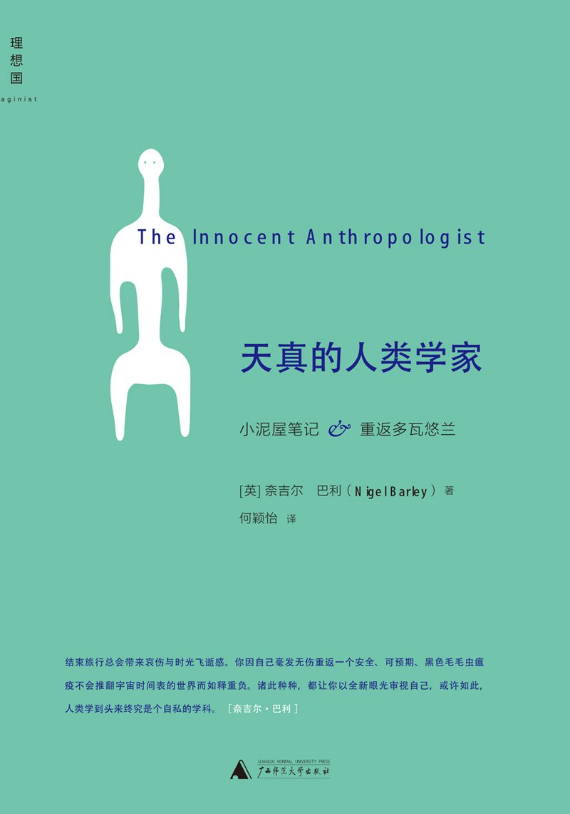

.. _n80:

《天真的人类学家》
=====================

* 关键词： ``人类学``
* 作者： [英国] 奈吉尔·巴利

作者简介
------------

奈吉尔·巴利 (Nigel Barley)，牛津大学人类学博士，前大英博物馆民族志学组附属人类博物馆（Museumof Mankind of the Ethnography Depar tment ofthe British Museum）馆长。

著有 Dancing on theGrave、Not a Hazardous Sport 、Ceremony、TheDuke of Puddle Dock、Smashing Pots 等书， 并为Channel4 电视台编写、主持Native Land 影集。

内容简介
------------

本书诚实但又不失风趣地记录了作为人类学家的作者在非洲喀麦隆多瓦悠人村落两次进行田野工作的经历，将人类学家如何克服乏味、灾难、生病与敌意的真实田野生活拍案叫绝地呈现在读者面前。

不同于一般的人类学研究报告，这是一部令人捧腹不止的人类学笔记，透过幽默的笔调，读者看到了人类学者如何与研究对象进行互动，在互动中如何调整他的学术成见，以及田野工作上的琐事如何影响后来研究结果、研究的盲点与反思。

因此不管是严肃的读者、无聊地只想打发时间或者是向往非洲原始部落的异国情调而蠢蠢欲动的旅人，巴利这本书绝对是一个有趣的选择。

读书笔记
------------

发散思考
------------

